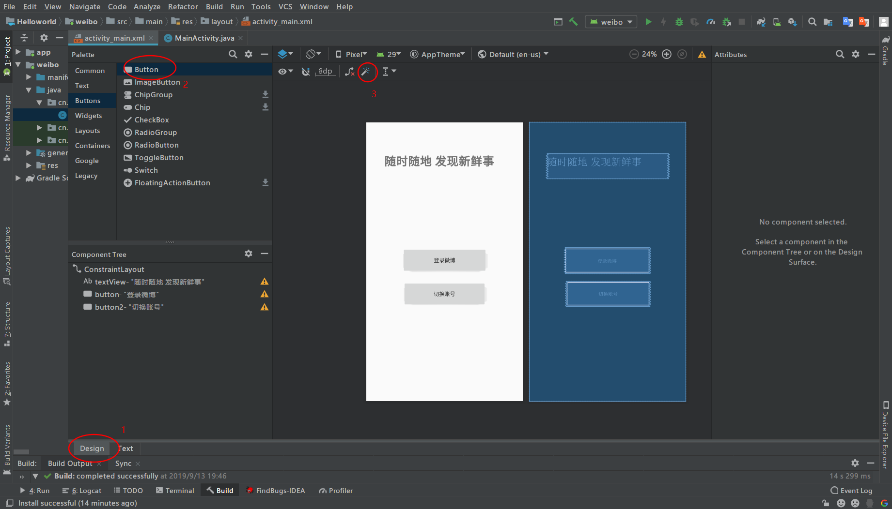

[TOC]

## 把本地项目通过sourcetree提交到github

### Github上建立仓库

命名方式为：学号_android

### ssh设置

由于之前使用git创建过ssh,因此直接调用即可。

如果没有该文件，可以生成后再操作。

### sourceTree克隆项目到本地

- 本地建立空文件夹，eg: d:/demo
- sourceTree克隆项目到demo

### 建立安卓项目

- 打开AndroidStudio,建立项目并选中demo作为项目路径
- 项目加载后关闭

### sourceTree推送

- 添加到暂存区
- 添加描述
- 提交
- 推送

## 创建weibo应用

1. new module 新建模块
2. 填好app名称以及包名
3. 创建empty activity
4. 创建button并修改文字
5. 点击魔法棒设置相对布局

操作如图：

结果显示：

## Android Studio彻底删除Module

- 在“Project”视图中选择需要删除的module名，此处**删除“app”**，点击右键，选择“Open Module Setting”，然后选择左上角的“-”号，将此module从“Test”项目列表中移除（并没有真正的从硬盘删除） 

- 再次在“app”上点击右键，出现“delete”选项，点击“delete”,将其从“Test”项目列表中彻底移除（此时真正的从硬盘移除） 

总结：工具学习动手操作才能理解，光听课学习效率不高。

