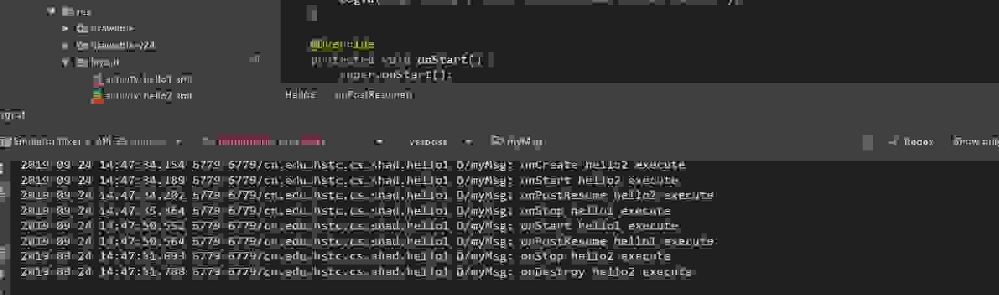
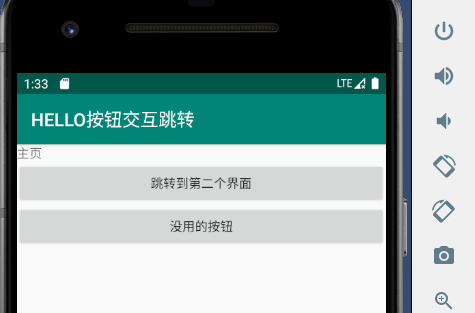
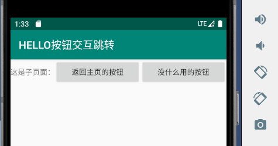

### 安卓的生命周期

Activity生命周期最主要的一些方法，启动后依次执行：

onCreate –> onStart –> onResume –> onPause –> onStop –> onDestroy

> 1.当Activity位于栈顶时，此时正好处于屏幕最前方，此时处于**运行状态**；
>
> 2.当Activity失去了焦点但仍然对用于可见（如栈顶的Activity是透明的或者栈顶Activity并不是铺满整个手机屏幕），此时处于**暂停状态**；
>
> 3.当Activity被其他Activity完全遮挡，此时此Activity对用户不可见，此时处于**停止状态**；
>
> 4.当Activity由于人为或系统原因（如低内存等）被销毁，此时处于**销毁状态；**


logcat日志如下：




<hr>

### 堆栈

> 在实际应用场景中，假设A Activity位于栈顶，此时用户操作，从A Activity跳转到B Activity。那么对AB来说，具体会回调哪些生命周期中的方法呢？回调方法的具体回调顺序又是怎么样的呢？
>
> 开始时，A被实例化，执行的回调有A:onCreate -> A:onStart -> A:onResume。
>
> **当用户点击A中按钮来到B时，假设B全部遮挡住了A，将依次执行A:onPause -> B:onCreate -> B:onStart -> B:onResume -> A:onStop。**
>
> **此时如果点击Back键，将依次执行B:onPause -> A:onRestart -> A:onStart -> A:onResume -> B:onStop -> B:onDestroy。**
>
> 至此，Activity栈中只有A。在Android中，有两个按键在影响Activity生命周期这块需要格外区分下，即Back键和Home键。我们先直接看下实验结果：
>
> **此时如果按下Back键，系统返回到桌面，并依次执行A:onPause -> A:onStop -> A:onDestroy。**
>
> **此时如果按下Home键（非长按），系统返回到桌面，并依次执行A:onPause -> A:onStop。由此可见，Back键和Home键主要区别在于是否会执行onDestroy。**
>
> **此时如果长按Home键，不同手机可能弹出不同内容，Activity生命周期未发生变化（由小米2s测的，不知道其他手机是否会对Activity生命周期有影响）。**


[参考教程：activity生命周期](https://www.cnblogs.com/lwbqqyumidi/p/3769113.html)

<hr>


### 按钮跳转

- 作业：两个按钮实现活动之间的跳转

- 如何使用debug模式，通过使用快捷键F7 F8 F9 ，

- 正则表达式的使用，主要是搜索文件


> 思路是：
>
> 1. hello1类实现onclickListener这个监听器
> 2. 重写onclick()方法，判断是点击了哪个View，添加intent意图，然后启动活动。
> 3. 装配响应事件settupClick()：创建按钮对象,该对象先后指向两个按钮，然后创建监听事件


预览图：







```java
package cn.edu.hstc.cs.shad.hello1;

import android.content.Intent;
import android.os.Bundle;
import android.util.Log;
import android.view.View;
import android.widget.Button;
import android.widget.Toast;

import androidx.appcompat.app.AppCompatActivity;

public class Hello1 extends AppCompatActivity implements View.OnClickListener {

    @Override
    protected void onCreate(Bundle savedInstanceState) {
        super.onCreate(savedInstanceState);
        setContentView(R.layout.activity_hello1);
        settupClick();
        Log.d("myMsg", "onCreate hello1 execute");
    }


    @Override
    protected void onStart() {
        super.onStart();
        Log.d("myMsg", "onStart hello1 execute");

    }

    @Override
    protected void onStop() {
        super.onStop();
        Log.d("myMsg", "onStop hello1 execute");

    }

    @Override
    protected void onPostResume() {
        super.onPostResume();
        Log.d("myMsg", "onPostResume hello1 execute");
    }

    @Override
    protected void onDestroy() {
        super.onDestroy();
        Log.d("myMsg", "onDestroy hello1 execute");

    }

    public void settupClick(){
        Button button;
        button = findViewById(R.id.btn1);
        button.setOnClickListener(this);
        button = findViewById(R.id.btn2);
        button.setOnClickListener(this);
    }

    @Override
    public void onClick(View view) {
        if(view.getId()==R.id.btn1){
            Intent intent=new Intent(Hello1.this,Hello2.class);
            startActivity(intent);
        }
        if(view.getId()==R.id.btn2){
            Toast.makeText(Hello1.this,"没什么用的~点旁边的按钮吧",Toast.LENGTH_LONG).show();
        }
    }
}

```


```java
package cn.edu.hstc.cs.shad.hello1;

import android.os.Bundle;
import android.util.Log;
import android.view.View;
import android.widget.Button;
import android.widget.Toast;

import androidx.appcompat.app.AppCompatActivity;

public class Hello2 extends AppCompatActivity implements View.OnClickListener {

    @Override
    protected void onCreate(Bundle savedInstanceState) {
        super.onCreate(savedInstanceState);
        setTitle("子页面");
        setContentView(R.layout.activity_hello2);
        settupClick();
        Log.d("myMsg", "onCreate hello2 execute");
    }

    @Override
    protected void onPostResume() {
        super.onPostResume();
        Log.d("myMsg", "onPostResume hello2 execute");
    }

    @Override
    protected void onStart() {
        super.onStart();
        Log.d("myMsg", "onStart hello2 execute");
    }

    @Override
    protected void onStop() {
        super.onStop();
        Log.d("myMsg", "onStop hello2 execute");
    }

    @Override
    protected void onDestroy() {
        super.onDestroy();
        Log.d("myMsg", "onDestroy hello2 execute");
    }

    public void settupClick(){
        Button button;
        button = findViewById(R.id.btn3);
        button.setOnClickListener(this);
        button = findViewById(R.id.btn4);
        button.setOnClickListener(this);
    }


    @Override
    public void onClick(View view) {
        if(view.getId()==R.id.btn3){
            finish();
        }
        if(view.getId()==R.id.btn4){
            Toast.makeText(Hello2.this,"少女祈祷中...",Toast.LENGTH_LONG).show();
        }
    }
}

```


