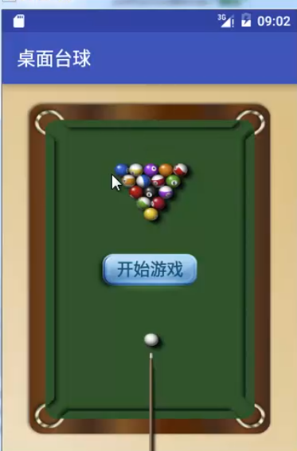

### 使用JavaLayout

- 创建桌面台球
- 删除res/layout/activity_main.xml
- 删除MainActivity.java里面引用布局文件的语句
- 创建帧布局管理器
- 拷贝图片到mipmap
- 设置背景图片语句
- 添加布局管理器
- 创建文本框对象
- 设置文本-开始游戏
- 设置大小，TypeValue类
- 设置颜色值，通过rgb值
- 新建对象，居中显示，设置布局高度宽度
- 文本对象添加布局
- 设置单击事件
- 单击设置事件，弹出框+提示
- 提示按钮-确定
- 取消按钮-退出
- 添加日志信息


``` java
package cn.edu.hstc.cs.shad.javalayout;

import androidx.appcompat.app.AlertDialog;
import androidx.appcompat.app.AppCompatActivity;

import android.content.DialogInterface;
import android.graphics.Color;
import android.os.Bundle;
import android.util.Log;
import android.util.TypedValue;
import android.view.Gravity;
import android.view.View;
import android.view.ViewGroup;
import android.widget.FrameLayout;
import android.widget.TextView;

public class MainActivity extends AppCompatActivity {

    @Override
    protected void onCreate(Bundle savedInstanceState) {
        super.onCreate(savedInstanceState);

        FrameLayout frameLayout = new FrameLayout(this);
        frameLayout.setBackgroundResource(R.mipmap.a);
        setContentView(frameLayout);

        TextView textView = new TextView(this);
        textView.setText("开始游戏");
        textView.setTextSize(TypedValue.COMPLEX_UNIT_SP,18);
        textView.setTextColor(Color.rgb(17,85,114));

        FrameLayout.LayoutParams params = new FrameLayout.LayoutParams(ViewGroup.LayoutParams.WRAP_CONTENT,
                ViewGroup.LayoutParams.WRAP_CONTENT);
        params.gravity= Gravity.CENTER;
        textView.setLayoutParams(params);
        textView.setOnClickListener(new View.OnClickListener() {
            @Override
            public void onClick(View view) {
                new AlertDialog.Builder(MainActivity.this).setTitle("系统提示")
                        .setMessage("游戏有风险")
                        .setPositiveButton("确定",
                                new DialogInterface.OnClickListener() {
                                    @Override
                                    public void onClick(DialogInterface dialogInterface, int i) {
                                        Log.i("桌面台球","进入游戏");
                                    }
                                }).setNegativeButton("退出", new DialogInterface.OnClickListener() {
                    @Override
                    public void onClick(DialogInterface dialogInterface, int i) {
                        Log.i("桌面台球","退出游戏");
                        finish();
                    }
                }).show();
            }
        });
        frameLayout.addView(textView);
    }
}

```

