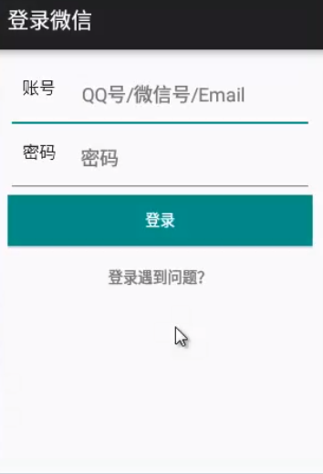

### 线性布局管理器LinearLayout

> orientation设置垂直排列/水平排列
> gravity 显示位置，可以设置多个参数，使用|分割
> layout_weight  按照比例分配剩余空间


<hr>


### 实现微信登录页面 

应用线性布局管理器




```xml
           android:theme="@style/Theme.AppCompat.Light.DarkActionBar">
```

```xml
<?xml version="1.0" encoding="utf-8"?>
<LinearLayout xmlns:android="http://schemas.android.com/apk/res/android"
    xmlns:app="http://schemas.android.com/apk/res-auto"
    xmlns:tools="http://schemas.android.com/tools"
    android:layout_width="match_parent"
    android:layout_height="match_parent"
    android:orientation="vertical"
    tools:context=".MainActivity">

    <EditText
        android:layout_width="match_parent"
        android:layout_height="wrap_content"
        android:paddingBottom="20dp"
        android:hint="QQ号/微信号/Email"
        android:drawableLeft="@mipmap/zhanghao"
        />

    <EditText
        android:layout_width="match_parent"
        android:layout_height="wrap_content"
        android:paddingBottom="20dp"
        android:hint="密码"
        android:drawableLeft="@mipmap/mima"
        />

    <Button
        android:layout_width="match_parent"
        android:layout_height="wrap_content"
        android:text="登录"
        android:textColor="#FFFFFF"
        android:background="#FF009688"
        />
    <TextView
        android:layout_width="wrap_content"
        android:layout_height="wrap_content"
        android:text="忘记密码？"
        android:paddingTop="20dp"
        android:layout_gravity="center_horizontal"
        app:layout_constraintBottom_toBottomOf="parent"
        app:layout_constraintLeft_toLeftOf="parent"
        app:layout_constraintRight_toRightOf="parent"
        app:layout_constraintTop_toTopOf="parent" />

</LinearLayout>
```

