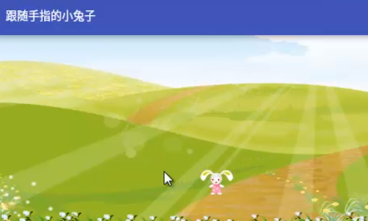

### 创建跟随手指移动的兔子

自定义view

1. framelayot
2. backgroud背景
3. 设置id可供获取
4. 删除文本框组件
5. 创建java class---RabbitView，继承View
6. 创建构造方法
7. 创建属性x,y坐标
8. 设置默认坐标
9. 重写onDraw方法
10. new Paint（）画笔对象
11. 创建位置对象
12. 绘制兔子
13. 绘制对象，x,y,画笔
14. 判断是否被回收
15. 强制回收图片
16. 创建帧布局管理器对象并获取ID
17. 创建兔子view对象
18. 设置兔子触摸监听器
19. 设置x，y坐标等于手指位置
20. 重绘兔子
21. 返回true
22. 帧布局添加兔子