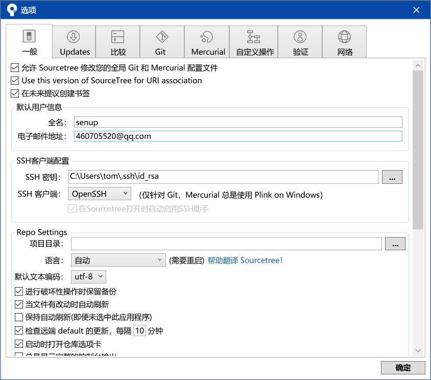

# 《安卓开发课程》の仓库

## 把本地项目通过sourcetree提交到github

### Github上建立仓库

命名方式为：学号_android

### ssh设置

### sourceTree克隆项目到本地

- 本地建立空文件夹，eg: d:/demo
- sourceTree克隆项目到demo

### 建立安卓项目

- 打开AndroidStudio,建立项目并选中demo作为项目路径
- 项目加载后关闭

### sourceTree推送

- 添加到暂存区
- 添加描述
- 提交
- 推送

总结：工具学习动手操作才能理解，光听课学习效率不高。

