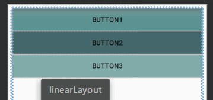

# Activityの启动模式

## 创建空活动项目

new Activity*3

<hr>

创建空活动项目**add no activity**时，出现android app启动错误:**Default Activity not found**

在AndroidManifest.xml中填入activity标签信息即可：

>             <intent-filter>
>                 <action android:name="android.intent.action.MAIN" />
>                 <category android:name="android.intent.category.LAUNCHER" />
>             </intent-filter>

如下

    <application android:allowBackup="true" android:icon="@mipmap/ic_launcher"
            android:label="@string/app_name" android:supportsRtl="true" android:theme="@style/AppTheme">
            <activity android:name=".MainActivity">
                <intent-filter>
                    <action android:name="android.intent.action.MAIN" />
                    <category android:name="android.intent.category.LAUNCHER" />
                </intent-filter>
            </activity>
        </application>


# 配置按钮

每个页面配置三个按钮，跳转到三个不同的页面

[配色参考：日本の伝統色](https://color.uisdc.com/jp/)



``` xml
<LinearLayout
    android:id="@+id/linearLayout"
    android:layout_width="0dp"
    android:layout_height="0dp"
    android:layout_marginStart="8dp"
    android:layout_marginTop="8dp"
    android:layout_marginEnd="8dp"
    android:layout_marginBottom="8dp"
    android:orientation="vertical"
    app:layout_constraintBottom_toBottomOf="parent"
    app:layout_constraintEnd_toEndOf="parent"
    app:layout_constraintStart_toStartOf="parent"
    app:layout_constraintTop_toTopOf="parent">

    <Button
        android:id="@+id/button1"
        android:layout_width="match_parent"
        android:layout_height="wrap_content"
        android:background="#895b8a"
        android:text="Button1" />

    <Button
        android:id="@+id/button2"
        android:layout_width="match_parent"
        android:layout_height="wrap_content"
        android:background="#824880"
        android:text="Button2" />

    <Button
        android:id="@+id/button3"
        android:layout_width="match_parent"
        android:layout_height="wrap_content"
        android:background="#915c8b"
        android:text="Button3" />
</LinearLayout>
```


# 添加单击事件

```java
    @Override
    protected void onCreate(Bundle savedInstanceState) {
        super.onCreate(savedInstanceState);
        setContentView(R.layout.activity_hello1);
        setTitle("Hello1");
        //每次create活动+1
        objCount++;
        mobjCount=objCount;
        settupClick();
        Log.d(myMsg, "onCreate hello1 execute"+mobjCount);
    }


	public void settupClick(){
        Button button;
        button = findViewById(R.id.button1);
        button.setOnClickListener(this);
        button = findViewById(R.id.button2);
        button.setOnClickListener(this);
        button = findViewById(R.id.button3);
        button.setOnClickListener(this);
    }

    @Override
    public void onClick(View view) {
        if(view.getId()==R.id.button1){
            Intent intent=new Intent(hello1.this,hello1.class);
            startActivity(intent);
        }
        if(view.getId()==R.id.button2){
            Intent intent=new Intent(hello1.this,hello2.class);
            startActivity(intent);
        }
        if(view.getId()==R.id.button3){
            Intent intent=new Intent(hello1.this,hello3.class);
            startActivity(intent);
        }
    }
```


# 配置启动模式

活动的启动模式一共有 4 种，分别是standard、singleTop、singleTask 和 singleInstance。

> 可以 在AndroidManifest.xml 中通过给 <activity> 标签指定 android:launchMode 属性来选择启动模式。

```xml
        <activity android:name=".hello1" android:launchMode="singleInstance">
            <intent-filter>
                <action android:name="android.intent.action.MAIN" />

                <category android:name="android.intent.category.LAUNCHER" />
            </intent-filter>
        </activity>
```


java文件代码

```java

    @Override
    protected void onCreate(Bundle savedInstanceState) {
        super.onCreate(savedInstanceState);
        setContentView(R.layout.activity_hello1);
        setTitle("Hello1");
        //每次create活动+1
        objCount++;
        mobjCount=objCount;
        settupClick();
        Log.d(myMsg, "onCreate hello1 execute"+mobjCount);
    }
    @Override
    protected void onStart() {
        super.onStart();
        Log.d(myMsg, "onStart hello1 execute"+mobjCount);

    }

    @Override
    protected void onPause() {
        super.onPause();
        Log.d(myMsg, "onPause hello1 execute"+mobjCount);

    }

    @Override
    protected void onStop() {
        super.onStop();
        Log.d(myMsg, "onStop hello1 execute"+mobjCount);

    }

    @Override
    protected void onResume() {
        super.onResume();
        Log.d(myMsg, "onResume hello1 execute"+mobjCount);

    }

    @Override
    protected void onDestroy() {
        super.onDestroy();
        //每次onDestroy活动-1
        objCount--;
        Log.d(myMsg, "onDestroy hello1 execute"+mobjCount);

    }

```


### standard 模式

> standard 是活动默认的启动模式。在 standard 模式下，每启动一个新的活动，它就会在栈中入栈，并处于栈顶的位置。系统不会判断这个活动是否已经在栈中存在，每次启动都会创建该活动的一个新的实例。

现在打开`logcat`,搜索框输入`log`，启动+重新点击按钮1 的情况下输出日志：

```
2019-09-27 21:24:49.633 8082-8082/cn.edu.hstc.cs.shad.prj03 D/log: onCreate hello1 execute1
2019-09-27 21:24:49.667 8082-8082/cn.edu.hstc.cs.shad.prj03 D/log: onStart hello1 execute1
2019-09-27 21:24:49.673 8082-8082/cn.edu.hstc.cs.shad.prj03 D/log: onResume hello1 execute1
2019-09-27 21:25:03.565 8082-8082/cn.edu.hstc.cs.shad.prj03 D/log: onPause hello1 execute1
2019-09-27 21:25:03.734 8082-8082/cn.edu.hstc.cs.shad.prj03 D/log: onCreate hello1 execute2
2019-09-27 21:25:03.752 8082-8082/cn.edu.hstc.cs.shad.prj03 D/log: onStart hello1 execute2
2019-09-27 21:25:03.755 8082-8082/cn.edu.hstc.cs.shad.prj03 D/log: onResume hello1 execute2
2019-09-27 21:25:04.606 8082-8082/cn.edu.hstc.cs.shad.prj03 D/log: onStop hello1 execute1
```


### singleTop 模式

> 在 singleTop 模式下，启动活动时，如果发现栈顶已经是该活动，则直接使用它，而不会再创建新的活动实例。

现在打开`logcat`,搜索框输入`log`，启动+点击按钮2+点击按钮1 的情况下输出日志：

```xml
2019-09-27 21:30:52.315 8211-8211/cn.edu.hstc.cs.shad.prj03 D/log: onCreate hello1 execute1
2019-09-27 21:30:52.339 8211-8211/cn.edu.hstc.cs.shad.prj03 D/log: onStart hello1 execute1
2019-09-27 21:30:52.355 8211-8211/cn.edu.hstc.cs.shad.prj03 D/log: onResume hello1 execute1
2019-09-27 21:30:59.898 8211-8211/cn.edu.hstc.cs.shad.prj03 D/log: onPause hello1 execute1
2019-09-27 21:31:00.303 8211-8211/cn.edu.hstc.cs.shad.prj03 D/log: onCreate Hello2 execute1
2019-09-27 21:31:00.314 8211-8211/cn.edu.hstc.cs.shad.prj03 D/log: onStart Hello2 execute1
2019-09-27 21:31:00.315 8211-8211/cn.edu.hstc.cs.shad.prj03 D/log: onResume Hello2 execute1
2019-09-27 21:31:01.329 8211-8211/cn.edu.hstc.cs.shad.prj03 D/log: onStop hello1 execute1
2019-09-27 21:31:15.570 8211-8211/cn.edu.hstc.cs.shad.prj03 D/log: onPause Hello2 execute1
2019-09-27 21:31:15.733 8211-8211/cn.edu.hstc.cs.shad.prj03 D/log: onCreate hello1 execute2
2019-09-27 21:31:15.747 8211-8211/cn.edu.hstc.cs.shad.prj03 D/log: onStart hello1 execute2
2019-09-27 21:31:15.748 8211-8211/cn.edu.hstc.cs.shad.prj03 D/log: onResume hello1 execute2
2019-09-27 21:31:16.696 8211-8211/cn.edu.hstc.cs.shad.prj03 D/log: onStop Hello2 execute1
```


### singleTask 模式

> 当活动的启动模式为 singleTask 时，每次启动该活动，系统首先会在栈中检查是否已存在该活动的实例，如果发现已经存在则直接使用该实例，并把在这个活动之上的所有活动统统出栈，如果没有发现就会创建一个新的活动实例。

现在打开`logcat`,搜索框输入`log`，启动+点击按钮2+点击按钮1 的情况下输出日志：

```verilog
2019-09-27 21:34:23.659 8340-8340/cn.edu.hstc.cs.shad.prj03 D/log: onCreate hello1 execute1
2019-09-27 21:34:23.695 8340-8340/cn.edu.hstc.cs.shad.prj03 D/log: onStart hello1 execute1
2019-09-27 21:34:23.698 8340-8340/cn.edu.hstc.cs.shad.prj03 D/log: onResume hello1 execute1
2019-09-27 21:34:29.349 8340-8340/cn.edu.hstc.cs.shad.prj03 D/log: onPause hello1 execute1
2019-09-27 21:34:29.555 8340-8340/cn.edu.hstc.cs.shad.prj03 D/log: onCreate Hello2 execute1
2019-09-27 21:34:29.568 8340-8340/cn.edu.hstc.cs.shad.prj03 D/log: onStart Hello2 execute1
2019-09-27 21:34:29.574 8340-8340/cn.edu.hstc.cs.shad.prj03 D/log: onResume Hello2 execute1
2019-09-27 21:34:30.440 8340-8340/cn.edu.hstc.cs.shad.prj03 D/log: onStop hello1 execute1
2019-09-27 21:34:32.146 8340-8340/cn.edu.hstc.cs.shad.prj03 D/log: onPause Hello2 execute1
2019-09-27 21:34:32.215 8340-8340/cn.edu.hstc.cs.shad.prj03 D/log: onStart hello1 execute1
2019-09-27 21:34:32.216 8340-8340/cn.edu.hstc.cs.shad.prj03 D/log: onResume hello1 execute1
2019-09-27 21:34:33.078 8340-8340/cn.edu.hstc.cs.shad.prj03 D/log: onStop Hello2 execute1
2019-09-27 21:34:33.084 8340-8340/cn.edu.hstc.cs.shad.prj03 D/log: onDestroy Hello2 execute1
```


### singleInstance 模式

> singleInstance 模式的活动会启用一个新的栈来管理这个活动。想象这样的场景，假设程序中有一个活动允许其他程序调用，可以通过 singleInstance 模式实现其他程序和这个程序共享活动实例。


现在打开`logcat`,搜索框输入`log`，启动+点击按钮2+点击按钮1+点击按钮1 的情况下输出日志：

```verilog
2019-09-27 21:37:19.457 8482-8482/cn.edu.hstc.cs.shad.prj03 D/log: onCreate hello1 execute1
2019-09-27 21:37:19.485 8482-8482/cn.edu.hstc.cs.shad.prj03 D/log: onStart hello1 execute1
2019-09-27 21:37:19.494 8482-8482/cn.edu.hstc.cs.shad.prj03 D/log: onResume hello1 execute1
2019-09-27 21:37:25.016 8482-8482/cn.edu.hstc.cs.shad.prj03 D/log: onPause hello1 execute1
2019-09-27 21:37:25.220 8482-8482/cn.edu.hstc.cs.shad.prj03 D/log: onCreate Hello2 execute1
2019-09-27 21:37:25.239 8482-8482/cn.edu.hstc.cs.shad.prj03 D/log: onStart Hello2 execute1
2019-09-27 21:37:25.242 8482-8482/cn.edu.hstc.cs.shad.prj03 D/log: onResume Hello2 execute1
2019-09-27 21:37:26.616 8482-8482/cn.edu.hstc.cs.shad.prj03 D/log: onStop hello1 execute1
2019-09-27 21:37:28.877 8482-8482/cn.edu.hstc.cs.shad.prj03 D/log: onPause Hello2 execute1
2019-09-27 21:37:29.068 8482-8482/cn.edu.hstc.cs.shad.prj03 D/log: onStart hello1 execute1
2019-09-27 21:37:29.073 8482-8482/cn.edu.hstc.cs.shad.prj03 D/log: onResume hello1 execute1
2019-09-27 21:37:30.070 8482-8482/cn.edu.hstc.cs.shad.prj03 D/log: onStop Hello2 execute1
2019-09-27 21:37:35.498 8482-8482/cn.edu.hstc.cs.shad.prj03 D/log: onPause hello1 execute1
2019-09-27 21:37:35.499 8482-8482/cn.edu.hstc.cs.shad.prj03 D/log: onResume hello1 execute1
```


[参考](https://www.jianshu.com/p/765c3395bad6)