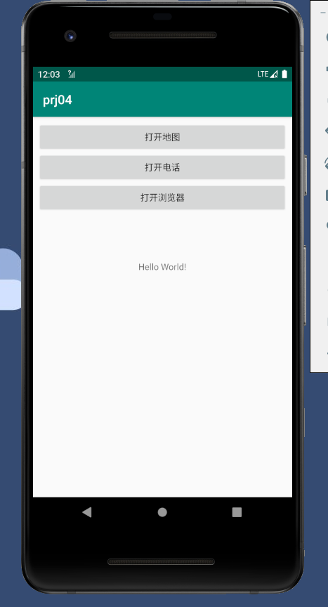
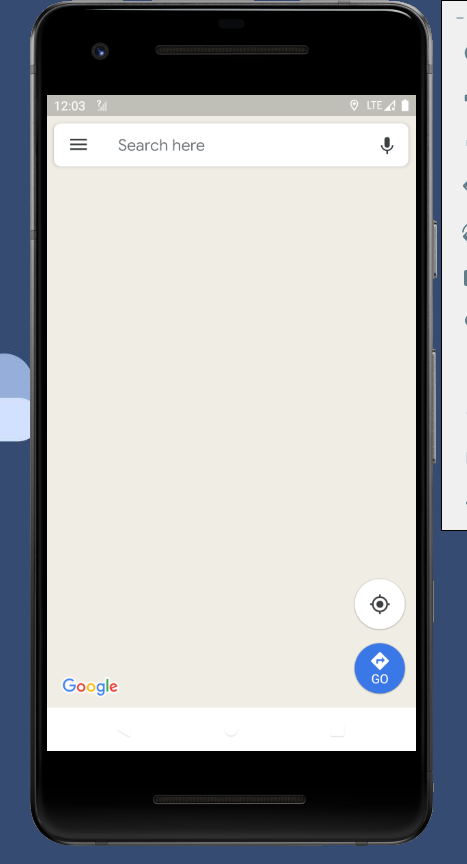
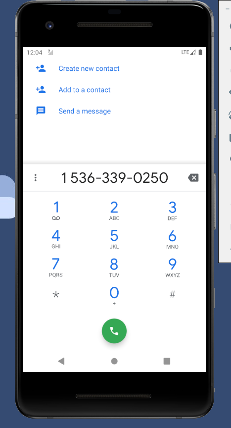
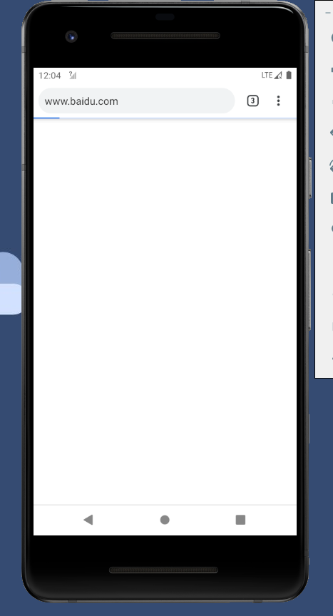

# 隐式INTENT启动浏览器 地图 拨号

### 实现效果如下











### 布局配置

定义三个按钮

```xml
    <LinearLayout
        android:id="@+id/linearLayout"
        android:layout_width="0dp"
        android:layout_height="0dp"
        android:layout_marginStart="8dp"
        android:layout_marginTop="8dp"
        android:layout_marginEnd="8dp"
        android:layout_marginBottom="8dp"
        android:orientation="vertical"
        app:layout_constraintBottom_toTopOf="@+id/textView"
        app:layout_constraintEnd_toEndOf="parent"
        app:layout_constraintStart_toStartOf="parent"
        app:layout_constraintTop_toTopOf="parent">

        <Button
            android:id="@+id/map"
            android:layout_width="match_parent"
            android:layout_height="wrap_content"
            android:text="打开地图" />

        <Button
            android:id="@+id/call"
            android:layout_width="match_parent"
            android:layout_height="wrap_content"
            android:text="打开电话" />

        <Button
            android:id="@+id/browser"
            android:layout_width="match_parent"
            android:layout_height="wrap_content"
            android:text="打开浏览器" />
    </LinearLayout>
```

### 配置java代码

```java
package cn.edu.hstc.cs.shad.prj04;

import androidx.appcompat.app.AppCompatActivity;

import android.content.Intent;
import android.net.Uri;
import android.os.Bundle;
import android.view.View;
import android.widget.Button;

public class MainActivity extends AppCompatActivity {

    @Override
    protected void onCreate(Bundle savedInstanceState) {
        super.onCreate(savedInstanceState);
        setContentView(R.layout.activity_main);
        Button map = findViewById(R.id.map);
        Button call = findViewById(R.id.call);
        Button browser = findViewById(R.id.browser);
        map.setOnClickListener(onClickListener);
        call.setOnClickListener(onClickListener);
        browser.setOnClickListener(onClickListener);

    }

    View.OnClickListener onClickListener=new View.OnClickListener(){

        @Override
        public void onClick(View view) {
            Intent intent = new Intent();
            Button button= (Button) view;
            switch (button.getId()){
                case R.id.browser:
                    intent.setAction(Intent.ACTION_VIEW);
                    intent.setData(Uri.parse("http://www.baidu.com"));
                    //intent.addFlags(Intent.FLAG_ACTIVITY_NEW_TASK);
                    startActivity(intent);
                    break;
                case R.id.call:
                    intent.setAction(Intent.ACTION_DIAL);
                    intent.setData(Uri.parse("tel:15363390250"));
                    startActivity(intent);
                    break;
                case R.id.map:
                    intent.setAction(Intent.ACTION_VIEW);
                    intent.setData(Uri.parse("geo:38.899533,-77.036476"));
                    startActivity(intent);
                    break;

            }

        }
    };
}

```

### 配置xml

```xml
<?xml version="1.0" encoding="utf-8"?>
<manifest xmlns:android="http://schemas.android.com/apk/res/android"
    package="cn.edu.hstc.cs.shad.prj04">

    <uses-permission android:name="android.permission.CALL_PHONE" />
    <uses-permission android:name="android.permission.INTERNET" />
    <uses-permission android:name="android.permission.ACCESS_FINE_LOCATION" />

    <application
        android:allowBackup="true"
        android:icon="@mipmap/ic_launcher"
        android:label="@string/app_name"
        android:roundIcon="@mipmap/ic_launcher_round"
        android:supportsRtl="true"
        android:theme="@style/AppTheme">
        <activity android:name=".MainActivity">
            <intent-filter>
                <action android:name="android.intent.action.MAIN" />
                <data android:scheme="http" />
                <category android:name="android.intent.category.LAUNCHER" />
                <category android:name="android.intent.category.BROWSABLE"/>
            </intent-filter>
        </activity>
    </application>

</manifest>
```

