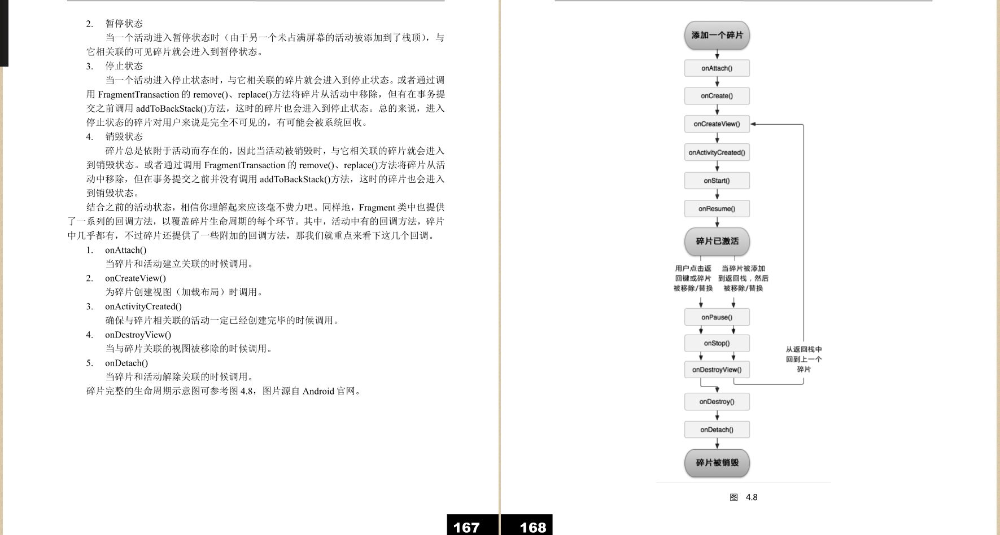
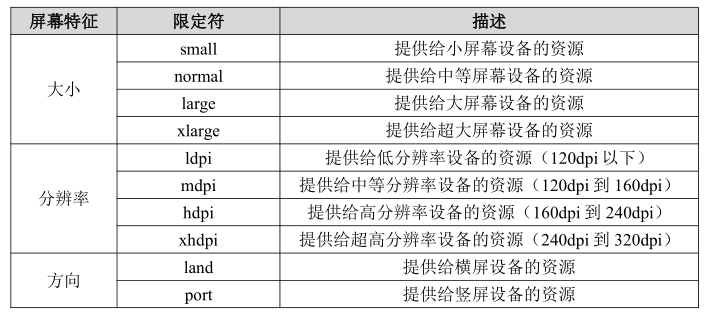

[TOC]


# Fragment的简单用法

分别新建左部分两个布局文件，再创建相应的类继承自fragment加载布局。同理创建右部分。然后在 `activity_main.xml`引用两个fragment的布局文件，运行程序即可。

# 动态添加碎片

在`activity_main.xml`中右边布局文件中藏了一个fragment碎片，然后在左侧按钮的单击事件里面触发事件：把右侧布局的id和碎片两个参数传入后进行替换，从而实现动态添加碎片。


#  FrameLayout

它没有任何的定位方式，所有的控件都会摆放在布局的左上角。


# 碎片和活动之间进行通信

### 在活动中调用碎片里的方法

```java
RightFragment rightFragment = (RightFragment) getFragmentManager()
.findFragmentById(R.id.right_fragment);
```

调用 `FragmentManager `的 `findFragmentById()`方法，可以在活动中得到相应碎片的实例，然后就能轻松地调用碎片里的方法了。

### 在碎片中调用活动里的方法

在每个碎片中都可以通过调用 `getActivity()`方法来得到和当前碎片相关联的活动实例，代码如下所示：
`MainActivity activity = (MainActivity) getActivity();`

### 碎片和碎片之间进行通信

基本思路非常简单，首先在一个碎片中可以得到与它相关联的活动，然后再通过这个活动去获取另外一个碎片的实例，这样也就实现了不同碎片之间的通信功能。

# 碎片的生命周期

一共有运行状态、暂停状态、停止状态和销毁状态这四种。



碎片还提供了一些附加的回调方法，那我们就重点来看下这几个回调。
> 1. onAttach()
>   当碎片和活动建立关联的时候调用。
> 2. onCreateView()
>   为碎片创建视图（加载布局）时调用。
> 3. onActivityCreated()
>   确保与碎片相关联的活动一定已经创建完毕的时候调用。
> 4. onDestroyView()
>   当与碎片关联的视图被移除的时候调用。
> 5. onDetach()
>   当碎片和活动解除关联的时候调用。


<hr>

# 动态加载布局的技巧

> *如果程序能够根据设备的分辨率或屏幕大小在运行时来决定加载哪个布局，那我们可发挥的空间就更多了。因此本节我们就来探讨一Android 中动态加载布局的技巧。*

### 单页双页的判断问题

思路：通过限定符区分使用哪个布局。

 large 就是一个限定符，那些屏幕被认为是 large 的设备就会自动加载 layout-large文件夹下的布局，而小屏幕的设备则还是会加载layout 文件夹下的布局。

### large 指多大？最小宽度限定符的使用

有的时候我们希望可以更加灵活地为不同设备加
载布局，不管它们是不是被系统认定为“large”，这时就可以使用最小宽度限定符
（Smallest-width Qualifier）了。
最小宽度限定符允许我们对屏幕的宽度指定一个最小指（以 dp 为单位），然后以这个最
小值为临界点，屏幕宽度大于这个值的设备就加载一个布局，屏幕宽度小于这个值的设备就
加载另一个布局。
在 res 目录下新建 layout-sw600dp 文件夹，然后在这个文件夹下新建 activity_main.xml
布局，代码如下所示：

``` xml
<LinearLayout xmlns:android="http://schemas.android.com/apk/res/android"
android:layout_width="match_parent"
android:layout_height="match_parent" >
<fragment
android:id="@+id/left_fragment"
android:name="com.example.fragmenttest.LeftFragment"
android:layout_width="0dp"
android:layout_height="match_parent"
android:layout_weight="1" />
<fragment
android:id="@+id/right_fragment"
android:name="com.example.fragmenttest.RightFragment"
android:layout_width="0dp"
android:layout_height="match_parent"
android:layout_weight="3" />
</LinearLayout>
```

这就意味着，当程序运行在屏幕宽度大于 600dp 的设备上时，会加载 layout-sw600dp/
activity_main 布局，当程序运行在屏幕宽度小于 600dp 的设备上时，则仍然加载默认的
layout/activity_main 布局。


# 碎片的最佳实践——一个简易版的新闻应用


这就意味着，当程序运行在屏幕宽度大于 600dp 的设备上时，会加载 layout-sw600dp/
activity_main 布局，当程序运行在屏幕宽度小于 600dp 的设备上时，则仍然加载默认的
layout/activity_main 布局。

